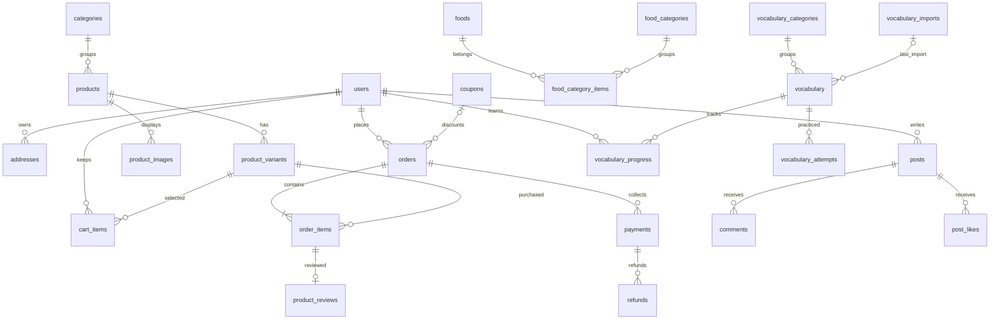

# Database `maianh`

Thiết kế gồm 36 bảng cho MySQL 8.0.16 trở lên, InnoDB, `utf8mb4` để lưu tiếng Việt, tiếng Hàn và emoji. Tiền tệ hiện tại là VND, dùng DECIMAL số nguyên; thời gian do backend gửi/lưu theo UTC rồi chuyển múi giờ khi hiển thị.

Đây là thiết kế và script khởi tạo. Backend/FE chưa đọc ghi database; dữ liệu mẫu trong JavaScript hiện có vẫn giữ nguyên. Không có tài khoản quản trị hoặc mật khẩu mặc định trong seed.

## File và cách tạo database

1. Mở MySQL Workbench, kết nối tới MySQL của bạn.
2. Mở và chạy `01_schema.sql` để tạo database **maianh** và các bảng.
3. Chạy `02_seed.sql` để thêm danh mục đúng với frontend.

Hoặc trong MySQL CLI đã đăng nhập:

```sql
SOURCE E:/maianh/DB/01_schema.sql;
SOURCE E:/maianh/DB/02_seed.sql;
SHOW TABLES FROM maianh;
```

`01_schema.sql` là migration ban đầu: chỉ chạy khi chưa có các bảng này. Không dùng DROP/TRUNCATE, không ghi đè database cũ. MySQL DDL không rollback toàn bộ file: nếu có lỗi giữa chừng, kiểm tra các bảng đã tạo trước khi chạy tiếp. `02_seed.sql` có thể chạy lại; không ghi đè tên danh mục đã sửa.

## Các nhóm dữ liệu

| Chức năng | Bảng | Vai trò |
|---|---|---|
| Tài khoản | `users`, `addresses`, `user_preferences` | Đăng nhập, hồ sơ, địa chỉ nhận hàng, tùy chọn thông báo |
| Sản phẩm | `categories`, `products`, `product_variants`, `product_images` | Danh mục, thông tin, SKU theo màu/kích thước, giá/tồn kho, ảnh |
| Giỏ hàng/yêu thích | `cart_items`, `wishlists` | Mỗi tài khoản có một giỏ; không trùng SKU hoặc sản phẩm yêu thích |
| Đơn hàng | `orders`, `order_items`, `order_status_history`, `coupons` | Đặt hàng, giá và địa chỉ tại thời điểm mua, lịch sử trạng thái, mã giảm giá |
| Thanh toán | `payments`, `refunds` | Các lần thanh toán/thử lại và hoàn tiền, khóa chống xử lý trùng |
| Đánh giá | `product_reviews` | Đánh giá gắn với dòng sản phẩm đã mua; suy ra người mua qua đơn hàng |
| Cộng đồng | `post_categories`, `posts`, `post_images`, `comments`, `post_likes`, `post_bookmarks`, `tags`, `post_tags` | Bài đăng, ảnh, bình luận, thích, lưu bài và hashtag |
| Thông báo/điểm | `notifications`, `points_ledger` | Hộp thông báo và lịch sử cộng/trừ điểm; tổng điểm tính bằng SUM |
| Random | `food_categories`, `foods`, `food_category_items`, `food_favorites`, `food_random_history` | Một món có thể thuộc nhiều nhóm; yêu thích và lịch sử lựa chọn |
| Tiếng Hàn | `vocabulary_categories`, `vocabulary_imports`, `vocabulary`, `vocabulary_progress`, `vocabulary_attempts` | Nhập từ CSV, từ vựng, trạng thái học, lịch sử flashcard/luyện gõ |

## Quy tắc backend cần thực hiện khi kết nối

- Chuẩn hóa email trước khi lưu; chỉ lưu `password_hash`, không lưu mật khẩu thô. Các luồng phiên đăng nhập/quên mật khẩu sẽ bổ sung bảng token khi triển khai xác thực.
- Giá và tồn kho nằm ở SKU, không ở giỏ hàng. Sản phẩm không có màu/size vẫn có một SKU với nhãn rỗng. Tạm ẩn bằng `status`/`is_active` thay vì xóa sản phẩm hoặc từ vựng có lịch sử.
- Khi đặt hàng, dùng một transaction: khóa các SKU theo thứ tự ID (`SELECT ... FOR UPDATE`), kiểm tra trạng thái/tồn kho, đọc giá từ DB, tính giảm giá và phí giao hàng, tạo đơn + dòng đơn + lịch sử, trừ tồn kho, xóa dòng giỏ đã mua. Không tin giá do FE gửi. `orders.subtotal` phải bằng tổng `order_items.line_total` — đây là ràng buộc liên bảng do service thực hiện.
- Địa chỉ nhận hàng, tên/SKU/màu/size/giá được chụp lại trong đơn. Thay đổi hồ sơ hoặc sản phẩm không làm thay đổi hóa đơn cũ. Các dữ liệu có đơn hàng dùng xóa mềm để giữ lịch sử.
- Khóa dòng coupon trong transaction trước khi kiểm tra giới hạn sử dụng. Đếm các đơn có coupon, loại đơn `cancelled`; đơn `returned` vẫn tính lượt đã dùng. Kiểm tra thời hạn và giới hạn theo người dùng. Schema chưa tự thực thi các giới hạn này bằng trigger.
- Chuyển trạng thái theo luồng `pending → confirmed → shipping → delivered`, có nhánh hủy trước khi giao và trả sau khi nhận. Ghi lịch sử cùng transaction. Hoàn tồn kho tối đa một lần khi hủy; trả hàng chỉ hoàn tồn sau khi xác nhận nhận lại hàng.
- Một đơn có nhiều lần thử thanh toán nhưng không thu vượt tổng đơn. Khóa đơn/thanh toán và kiểm tra tổng đã thu/đã hoàn trong transaction. Webhook phải xác minh với nhà cung cấp; dùng `idempotency_key` chống trùng. Không lưu số thẻ/CVV. Đơn tổng bằng 0 không tạo payment có amount 0.
- Chỉ cho chủ đơn đã giao tạo đánh giá. Quan hệ qua `order_item_id` xác định người mua và sản phẩm; backend kiểm tra quyền và trạng thái đơn.
- Like/bookmark/yêu thích được chống trùng bằng khóa ghép. Đếm like/bình luận và tổng điểm từ bảng nguồn, tránh bộ đếm lệch. Mỗi sự kiện cộng điểm có `event_key` duy nhất.
- Giỏ hàng và lịch sử khách chưa đăng nhập lưu ở trình duyệt; khi đăng nhập, hợp nhất giỏ trong transaction và kiểm tra lại tồn kho. Chatbot tiếng Hàn hiện tra từ cục bộ, chưa cần lưu hội thoại.

## Từ vựng CSV về sau

Thiết kế chọn **CSV là nguồn nhập**, MySQL lưu bản dùng cho API. Chưa viết importer và chưa thay dữ liệu cứng trong `FE/js/Korean.js`. Khi có CSV thật, chỉ cần ánh xạ cột theo mẫu dưới đây; không cần đổi các bảng mua sắm.

### Cột dự kiến

```csv
external_id,korean,romanization,vietnamese,category_code,category_name,word_type,example_ko,example_vi,level,audio_url
KR000001,안녕하세요,annyeonghaseyo,Xin chào,greeting,Chào hỏi,Cụm từ,"안녕하세요, 만나서 반갑습니다.","Xin chào, rất vui được gặp bạn.",beginner,
KR000002,가족,gajok,Gia đình,family,Gia đình,Danh từ,우리 가족은 네 명이에요.,Gia đình tôi có 4 người.,beginner,
```

- Bắt buộc: `external_id`, `korean`, `vietnamese`, `category_code`. `category_name` bắt buộc khi danh mục chưa tồn tại. Các cột còn lại có thể trống; `level` mặc định `beginner` (hoặc `intermediate`, `advanced`).
- UTF-8, chấp nhận BOM; dấu phân cách dấu phẩy. Dùng parser CSV chuẩn hỗ trợ dấu phẩy/xuống dòng trong dấu ngoặc kép và escape `""`; không dùng `split(',')`. Chuẩn hóa Unicode NFC và trim trường văn bản.
- `source_name` được chọn một lần cho bộ dữ liệu, ví dụ `korean-basic`, không suy ra từ tên file thay đổi theo ngày. `external_id` là mã ổn định như `KR000001`, tối đa 100 ký tự ASCII; không dùng số dòng hoặc từ tiếng Hàn làm ID. Cùng một từ có nhiều nghĩa có thể có nhiều mã riêng.
- Ánh xạ dữ liệu frontend: `kr → korean`, `roman → romanization`, `vi → vietnamese`, `cat → category_code`, `catName → category_name`, `type → word_type`, `exKr → example_ko`, `exVi → example_vi`.

### Quy trình importer cần triển khai

1. Đọc/kiểm tra toàn bộ file trước khi ghi: header, trường bắt buộc, độ dài, level, mã trùng trong file, category_code cùng mã nhưng khác tên. Báo số dòng lỗi; không nhập một phần file lỗi.
2. Bắt đầu transaction, tạo `vocabulary_imports` với SHA-256 của file, tên nguồn, số dòng và người nhập.
3. Tạo danh mục chưa có; không tự ghi đè tên danh mục đã được quản trị chỉnh.
4. Upsert theo UNIQUE `(source_name, external_id)`, cập nhật nội dung và `last_import_id`, giữ nguyên `vocabulary.id`. Không dùng REPLACE vì có thể xóa/tạo lại hàng và phá lịch sử học. Serialize các lần import cùng nguồn ở service.
5. Commit toàn bộ; lỗi thì rollback. Nhập lại cùng mã chỉ cập nhật từ, không làm mất `vocabulary_progress` hoặc `vocabulary_attempts`.
6. Từ vắng trong file mới mặc định vẫn giữ nguyên. Nếu cần đồng bộ toàn bộ, dùng bước riêng để đặt `is_active = false`; không xóa lịch sử. Tiến độ và lần trả lời phải cập nhật trong cùng transaction.

Một lần nhập thành công có một bản ghi `vocabulary_imports`. Lỗi chưa commit được ghi vào log importer, không phải bảng này. Index checksum giúp nhận diện file đã nhập nhưng không cấm nhập lại.

## Kết quả kiểm tra

Đã chạy schema và seed trên MySQL 8.0.46 trong instance tạm, tách biệt dịch vụ MySQL hiện có. Các kiểm tra đạt: tạo đủ 36 bảng; chạy seed hai lần không trùng dữ liệu; chặn số lượng 0 và khóa ngoại không tồn tại; mỗi người chỉ có một địa chỉ mặc định; tổng đơn và giá chụp lại không đổi khi sửa SKU; lưu đúng tiếng Hàn; upsert từ vựng giữ nguyên ID và tiến độ; không xóa được từ/SKU có lịch sử tham chiếu.

Instance tạm được dọn sau kiểm tra. Chưa khởi tạo `maianh` trên dịch vụ MySQL chính và chưa kiểm thử luồng API, importer CSV hoặc giao dịch đồng thời.

## Sơ đồ quan hệ chính



Sơ đồ lược bớt các bảng phụ cho dễ đọc; SQL là định nghĩa đầy đủ. Quan hệ đơn có ít nhất một dòng phải được backend bảo đảm trong transaction.

Tham chiếu MySQL: [CHECK constraints](https://dev.mysql.com/doc/refman/8.0/en/create-table-check-constraints.html), [foreign keys](https://dev.mysql.com/doc/refman/8.0/en/create-table-foreign-keys.html), [Unicode](https://dev.mysql.com/doc/refman/8.0/en/charset-unicode-utf8mb4.html).


### Tin tức và file đính kèm

Chạy `DB/tintuc_attachments.sql` sau khi import database để thêm bảng `post_attachments` và các chủ đề mặc định. Migration không xóa bài viết hiện có.

- `GET /api/tintuc/categories`: chủ đề và số bài công khai.
- `GET /api/tintuc?category=chat&page=1&limit=10&sort=new`: bài viết công khai; sort hỗ trợ `new`, `old`, `pinned`.
- `GET /api/tintuc/:id`: chi tiết bài viết công khai và file đính kèm.
- `POST /api/tintuc/uploads`: đăng nhập, body là file nhị phân, Content-Type `application/octet-stream`, `X-File-Name` là tên file encodeURIComponent; trả về ID file.
- `DELETE /api/tintuc/uploads/:id`: bỏ file của chính mình chưa gắn vào bài.
- `POST /api/tintuc`: JSON `{title, content, category_id, attachment_ids: []}`; đăng nhập và `X-Requested-With: maianh-web` cho mọi thao tác ghi.

File lưu trong `BE/uploads/tintuc`, database lưu URL `/uploads/tintuc/...`. Tối đa 10 file/bài, 25 MB/file. Hỗ trợ JPG/PNG/WebP, MP4/WebM, PDF/DOCX/XLSX/PPTX. File tải lên nhưng chưa đăng được giữ để thử lại hoặc bỏ trong form; chưa có tác vụ tự động dọn file bỏ dở.


### Quà tặng số dư từ admin
Chạy `DB/admin_customer_gifts.sql` để tạo lịch sử tặng tiền và khóa chống cộng trùng. API trong `BE/src/routes/admin/user.js`: GET `/api/admin/customers`, GET/PATCH `/api/admin/customers/:id`, POST `/api/admin/customers/:id/gifts` với `{amount: "50000", key: "UUID"}`. Số tiền là VND nguyên dương; số dư tối đa theo cột DECIMAL(15,2). Cộng tiền, lịch sử và thông báo thực hiện cùng transaction.


### Học TOPIK có thưởng
Chạy `DB/korea_sessions.sql` sau khi import database. API tại `/api/korea`: GET `/topics`, POST `/sessions` với `{mode: "flashcard" hoặc "typing", category_id}`, POST `/sessions/:id/answer` với `{index, answer}` (`answer` chỉ dùng cho gõ). Phiên học chứa toàn bộ từ đang bật trong nhóm topik1…topik6, thứ tự ngẫu nhiên và tiếp tục phiên chưa hoàn thành. Mỗi phiên lật đủ thẻ cộng 50.000đ đúng một lần; phiên mới sau hoàn thành có thể tiếp tục nhận thưởng. Gõ đúng cộng 10.000đ, sai trừ 10.000đ; cần đủ 10.000đ trước khi trả lời. So khớp NFC, bỏ khoảng trắng đầu/cuối và gộp khoảng trắng liên tiếp, giữ khoảng cách giữa các từ. Chấm và cập nhật ví cùng transaction; gửi lại cùng index chỉ trả kết quả đã lưu.

Cập nhật TOPIK: lật thẻ chọn ngẫu nhiên tối đa 50 từ không trùng (nếu nhóm ít hơn 50 thì dùng toàn bộ); phiên lật cũ hơn 50 từ được đóng không thưởng khi chọn lại TOPIK và tạo bộ mới. POST `/api/korea/sessions/:id/skip` với `{index}` dành cho luyện gõ: bỏ qua câu, không tính đúng/sai và không cộng/trừ tiền.


### Email OTP (đăng ký và quên mật khẩu)
Chạy `DB/auth_otp.sql` trước khi dùng API. SMTP được cấu hình riêng trong `BE/.env`; không đưa mật khẩu SMTP vào SQL hoặc frontend.
- `POST /api/auth/register`: gửi thông tin đăng ký như trước, trả HTTP 202 và `challenge_id`. Chưa tạo tài khoản.
- `POST /api/auth/forgot-password`: gửi `{email}`, trả `challenge_id` và thông báo chung.
- `POST /api/auth/verify-otp`: gửi `{challenge_id, code}` (code là chuỗi 6 số). Đăng ký: tạo tài khoản customer; quên mật khẩu: trả token đặt lại mật khẩu.
- `POST /api/auth/reset-password`: gửi `{token,password}`. Đổi mật khẩu và thu hồi các phiên đăng nhập.
OTP có hiệu lực 10 phút, tối đa 5 lần sai, chỉ lưu mã băm. Form Đăng nhập đã tích hợp bước OTP; có thể quay lại để yêu cầu mã mới. Sau xác thực, các OTP cùng email và mục đích bị vô hiệu hóa. Yêu cầu mã bị giới hạn 5 lần/15 phút/IP mỗi luồng.
